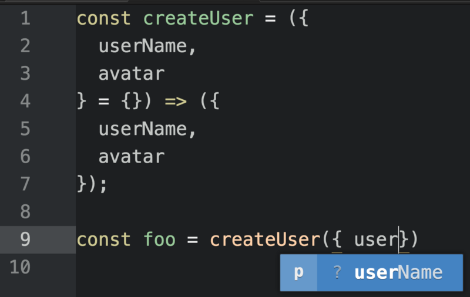
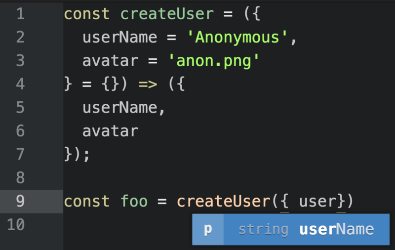

# JavaScript工厂函数（E6+）

工厂函数是一个任意非类或构造函数并返回一个对象的函数。在JavaScript中，任意一个函数可以返回一个对象。如果不需要使用new关键字时，这就是一个工厂函数

在JavaScript中工厂函数一直都非常有吸引力，以为它们能够轻松生成对象实例，而不用牵扯到复杂的类以及new关键字。

JavaScript提供了非常便利的对象字面量（object literal）语法。看起来像如下：

~~~~
const user = {̨
  userName: 'echo',
  avatar: 'echo.png'
};
~~~~

像JSON（基于JavaScript的对象字面量表示），冒号的左边是属性名称，右边是值。可以通过圆点符号（dot）来获取属性值：

`console.log(user.userName); // "echo"`

也可以通过方括号来获取属性值：

~~~~
const key = 'avatar';
console.log( user[key] ); // "echo.png"
~~~~

如果在作用域内有与预期属性名称相同的变量，则在创建对象时可以省略冒号和对象字面量的值。

~~~~
const userName = 'echo';
const avatar = 'echo.png';
const user = {
  userName,
  avatar
};
console.log(user);
// { "avatar": "echo.png",   "userName": "echo" }
~~~~

对象字面量支持简短的方法定义语法。我们添加一个`.setUserName()`的方法：

~~~~
const userName = 'echo';
const avatar = 'echo.png';
const user = {
  userName,
  avatar,
  setUserName (userName) {
    this.userName = userName;
    return this;
  }
};
console.log(user.setUserName('Foo').userName); // "Foo"
~~~~

在简短的方法定义中，this绑定到调用该方法的对象。调用一个对象的方法，可以简单地使用对象圆点符获取方法并使用圆括号来执行该方法，比如，game.play()会执行game对象的play()方法。通过圆点符来使用方法，这个方法必须是所讨论的的对象的一个属性。你也可以使用任意的函数的方法通过使用函数原型方法`.call()`, `.apply()` 或者`.bind()` 。

在这种情况下，`user.setUserName('Foo')` 调用 `user的setUserName()`方法，所以`this === user`。 在`setUserName()`方法中，我们通过`this`绑定改变了`user`对象的属性`userName`的值并且返回相同的对象实例给方法链。

### 字面量创建一个对象，工厂函数创建多个对象

如果你想创建多个对象，那么你会想要结合对象字面量和工厂函数的强大功能。

使用工厂函数，你可以创建任意数量的用户对象。例如，如果你在搭建一个聊天应用程序，你可以用一个用户对象表示当前用户，以及其它大量用户对象表示当前登录的和正在聊天的用户，这样你可以显示他们的名字和头像。

让我们把`user`对象改造成一个`createUser()`工厂：

~~~~
const createUser = ({ userName, avatar }) => ({
  userName,
  avatar,
  setUserName (userName) {
    this.userName = userName;
    return this;
  }
});
console.log(createUser({ userName: 'echo', avatar: 'echo.png' }));
/*
{
  "avatar": "echo.png",
  "userName": "echo",
  "setUserName": [Function setUserName]
}
*/
~~~~

### 返回对象

箭头函数`（=>）`具有隐式返回特征：如果函数体由单个表达式组成，则可以省略return关键字：`（）=>'foo'`是不带参数的函数，并返回字符串`“foo”`。

返回对象字面量时要小心。默认情况下，JavaScript假定你在使用大括号时创建函数体，例如`{broken：true}`。如果要对对象文字使用隐式返回，则需要通过将对象文字包含在括号中来消除歧义：

~~~~
const noop = () => { foo: 'bar' };
console.log(noop()); // undefined

const createFoo = () => ({ foo: 'bar' });
console.log(createFoo()); // { foo: "bar" }
~~~~

在第一个例子中，`foo：`被解释为一个标签，而`bar`被解释为一个不被赋值或返回的表达式。该函数返回未定义。

在`createFoo（）`示例中，括号强制大括号被解释为求值表达式，而不是函数体块。

###解构

要特别注意函数签名：

~~~~
const createUser = ({ userName, avatar }) => ({
~~~~

在这一行中，大括号`（{，}）`表示对象解构。此函数接受一个参数（一个对象），但是从该单个参数`userName`和`avatar`中解构两个正式参数。那些参数可以作为函数体作用域的变量使用。你还可以解构数组：

~~~~
const swap = ([first, second]) => [second, first];
console.log( swap([1, 2]) ); // [2, 1]
~~~~

你可以使用剩余参数和扩展语法`（... varName）`从数组（或参数列表）中获取其余的值，然后将这些数组元素分配给各个元素：

~~~~
const rotate = ([first, ...rest]) => [...rest, first];
console.log( rotate([1, 2, 3]) ); // [2, 3, 1]
~~~~

###计算的属性名

之前我们使用方括号计算的属性名记法来动态地判定要访问的对象属性：

~~~~
const key = 'avatar';
console.log( user[key] ); // "echo.png"
~~~~

我们还可以计算要分配给的键的值：

~~~~
const arrToObj = ([key, value]) => ({ [key]: value });
console.log( arrToObj([ 'foo', 'bar' ]) ); // { "foo": "bar" }
~~~~

在这个例子中，`arrToObj`使用一个由一个键/值对（也称为一个元组）组成的数组，并将其转换成一个对象。由于我们不知道键的名称，因此我们需要计算属性名称，以便在对象上设置键/值对。为此，我们从计算的属性名访问器借用方括号记法的想法，并重新在构建对象文字的上下文中使用它：

~~~~
{ [key]: value }
~~~~

在嵌入完成后，我得到了最终的对象：

~~~~
{ "foo": "bar" }
~~~~

### 默认参数值

JavaScript中的函数支持默认参数值，具有以下几个好处：
  1. 用户可以省略具有适当默认值的参数。
  2. 该功能更加自我注释，因为默认值提供了预期输入的示例。
  3. IDE和静态分析工具可以使用默认值来推断参数的预期类型。例如，默认值为1表示该参数可以接受Number类型。

使用默认参数，我们可以注明我们的`createUser`工厂函数的预期接口，并且如果未提供用户的信息，则自动填写“匿名”详细信息：

```
const createUser = ({
  userName = 'Anonymous',
  avatar = 'anon.png'
} = {}) => ({
  userName,
  avatar
});
console.log(
  // { userName: "Echo", avatar: 'anon.png' }
  createUser({ userName: 'echo' }),
  // { userName: "Anonymous", avatar: 'anon.png' }
  createUser()
);
```

函数签名的最后一部分可能看起来有点滑稽：

```
} = {}) => ({
```

参数签名关闭之前的最后一个= {}位表示如果没有传入此参数，我们将使用空对象作为默认值，如果没有参数传入。当您尝试从空对象，属性的默认值将自动使用，因为这是默认值：替换未定义与某些预定义值。

没有`= {}`默认值，没有参数的`createUser（）`将抛出错误，因为你不能试图undefined变量访问属性。

### 类型推断

JavaScript迄今为止没有任何原生的类型注释，但是多年来已经出现了几种竞争的样式，来填补空白，包括JSDoc（由于出现更好的选项而衰落），Facebook’s Flow和Microsoft的TypeScript。我使用rtype作为文档 - 一种记法，我发现比用于功能编程的TypeScript更具有可读性。

至今类型注释还没有明确的赢家。 JavaScript规范都没有任何替代方案得到祝福，而且在所有这些选项中似乎都有明显的缺点。

类型推断是基于使用它们的上下文推断类型的过程。在JavaScript中，类型注释是非常好的选择。

如果您在标准JavaScript函数签名中提供了足够的推理线索，您将获得类型注释的大部分优势，而不会造成任何成本或风险。

即使您决定使用类似于TypeScript或Flow的工具，也应尽可能多地使用类型推断，并在类型推断不足的情况下保存类型注释。例如，JavaScript中没有指定共享接口的本机方式。这对于TypeScript或rtype来说很简单和实用。

Tern.js是适用于JavaScript的流行类型推理工具，提供许多代码编辑器和IDE的插件。

Microsoft的Visual Studio代码不需要Tern，因为它将TypeScript的类型推断功能带入了常规的JavaScript代码。

当您为JavaScript中的函数指定默认参数时，可以使用类型推断的工具（如Tern.js，TypeScript和Flow）可以提供IDE提示，以帮助您正确使用正在使用的API。

没有默认值，IDE（经常人类）没有足够的提示来确定预期的参数类型。


<center>没有默认值，`userName`的类型是未知的。</center>

使用默认值，IDE（通常人类）可以从示例推断类型。


<center>使用默认值，IDE可以建议`userName`期待一个字符串。
</center>

将参数限制为固定类型（这将使通用函数和高阶函数变得困难）并不总是有意义的，但是当它有意义时，默认参数通常是最佳的方式，即使你'重新使用TypeScript或Flow。

### 工厂函数Mixin组合

工厂在使用好的调用API启动对象时非常出色。通常，它们是您需要的，但是一会儿，您会发现自己将类似的功能构建到不同类型的对象中，你需要将这些功能抽象到函数组合中，以便更轻松地重用它们。

这就是函数mixins闪耀的地方。我们来构建一个`withConstructor` mixin来将`.constructor`属性添加到所有的对象实例中。

```
//with-constructor.js:
const withConstructor = constructor => o => {
  const proto = Object.assign({},
    Object.getPrototypeOf(o),
    { constructor }
  );
  return Object.assign(Object.create(proto), o);
};
```

现在您可以导入它并与其他mixins使用它：

```
import withConstructor from `./with-constructor';
const pipe = (...fns) => x => fns.reduce((y, f) => f(y), x);
// or `import pipe from 'lodash/fp/flow';`
// Set up some functional mixins
const withFlying = o => {
  let isFlying = false;
  return {
    ...o,
    fly () {
      isFlying = true;
      return this;
    },
    land () {
      isFlying = false;
      return this;
    },
    isFlying: () => isFlying
  }
};
const withBattery = ({ capacity }) => o => {
  let percentCharged = 100;
  return {
    ...o,
    draw (percent) {
      const remaining = percentCharged - percent;
      percentCharged = remaining > 0 ? remaining : 0;
      return this;
    },
    getCharge: () => percentCharged,
    get capacity () {
      return capacity
    }
  };
};
const createDrone = ({ capacity = '3000mAh' }) => pipe(
  withFlying,
  withBattery({ capacity }),
  withConstructor(createDrone)
)({});
const myDrone = createDrone(({ capacity: '5500mAh' }));
console.log(`
  can fly:  ${ myDrone.fly().isFlying() === true }
  can land: ${ myDrone.land().isFlying() === false }
  battery capacity: ${ myDrone.capacity }
  battery status: ${ myDrone.draw(50).getCharge() }%
  battery drained: ${ myDrone.draw(75).getCharge() }%
`);
console.log(`
  constructor linked: ${ myDrone.constructor === createDrone }
`);
```

正如你所看到的，可重用的 `withConstructor（）` mixin只是简单地放入管道中与其他混合。 `withBattery（）` 可以与其他类型的对象一起使用，如机器人，电动滑板或便携式设备充电器。 `withFlying（）`
可用于模拟飞行汽车，火箭或气球。


组合更多的是一种思维方式，而不是代码中的特定技术。你可以在许多方面实现。函数组合只是从头开始构建的最简单的方法，而工厂函数是围绕实现细节包装一个友好的API的简单方法。

### 结论

 ES6提供了一个方便的语法来处理对象创建和工厂功能。大多数时候，这就是你需要的，但是因为这是JavaScript，还有一种方法让它更像Java：class关键字。


 ''在JavaScript中，类比工厂函数更加冗长和限制，而在重构方面，类则是一个雷区，但是它们也被React和Angular等主要前端框架所接受，而且还有一些罕见的使用 - 使复杂性值得的案例。

[阅读原文](https://medium.com/javascript-scene/javascript-factory-functions-with-es6-4d224591a8b1)
